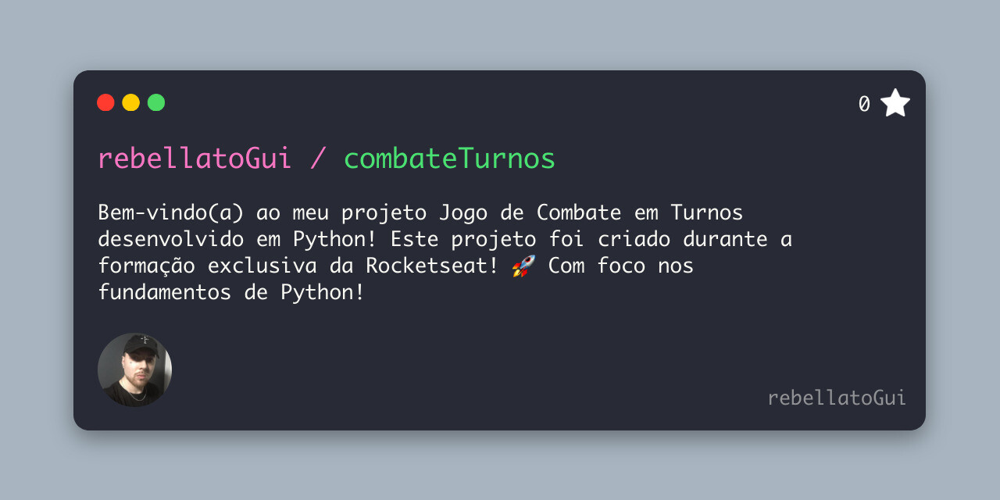

<h1 align="center"> CombateTurnos ⚔️ </h1>

Projeto feito durante a Formação exclusiva, promovida pela Rocketseat para ensino da tecnologia Python!

  <a href="#-tecnologias">Tecnologias</a>&nbsp;&nbsp;&nbsp;|&nbsp;&nbsp;&nbsp;
  <a href="#-projeto">Projeto</a>

  

 

## 🚀 Tecnologias

Esse projeto foi desenvolvido com as seguintes tecnologias:

- Python
- Git Bash

## 💻 Projeto

O Projeto é um jogo de Combate em Turnos onde você controla o Herói que possui habilidade especial!

Este projeto foi criado durante a formação exclusiva da Rocketseat! 🚀 Com foco nos fundamentos de Python!

---

Feito com ♥ by Rocketseat

[Participe da nossa comunidade!](https://discord.gg/rocketseat)
